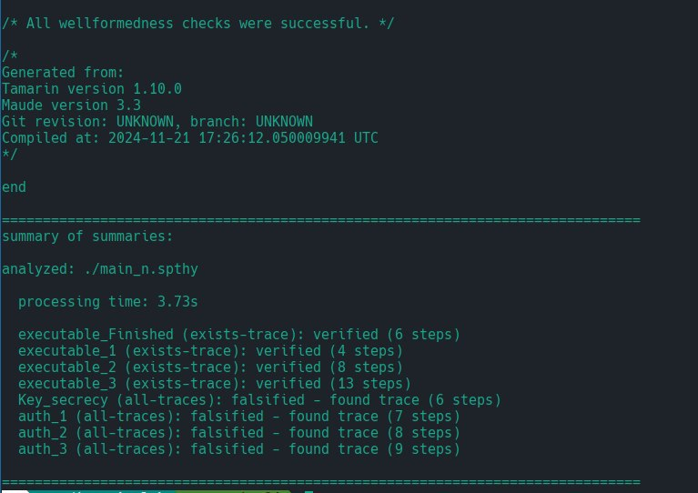

## Что нужно доказать:
- (+) Существует сервер, клиент и сессионный ключ такие, что клиент
смог установить соединение с сервером
- (+) Существует сервер, клиент и сообщение такое, что клиент
отправил первое сообщение, и сервер его получил
- (+) Существует сервер, клиент и сообщение такое, что сервер
отправил второе сообщение, и клиент его получил
- (+) Существует сервер, клиент и сообщение такое, что клиент
отправил третье сообщение, и сервер его получил

## Что нужно NEдоказать:
- (-) Для любого сервера, клиента и сессионного ключа, если клиент
смог установить соединение с сервером, то противник не может
узнать сессионный ключ
- (-) Для любого сервера, клиента и сообщения, если клиент смог
установить соединение с сервером и сервер получил первое
сообщение, то его отправил именно клиент
- (-) Для любого сервера, клиента и сообщения, если клиент смог
установить соединение с сервером и клиент получил второе
сообщение, то его отправил именно сервер
- (-) Для любого сервера, клиента и сообщения, если клиент смог
установить соединение с сервером и сервер получил третье
сообщение, то его отправил именно клиент

## Выполнение
